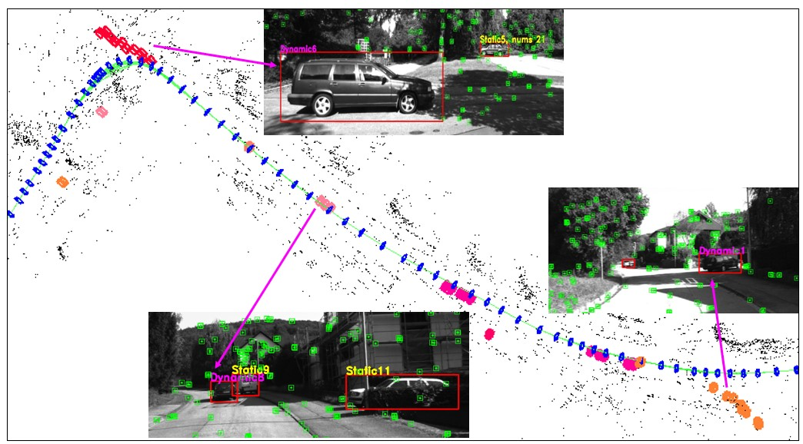
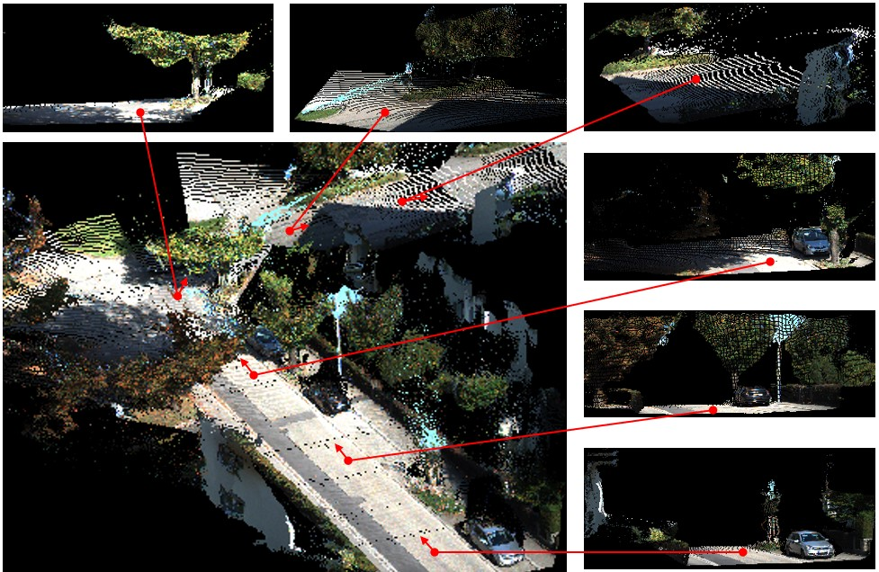

# slam-dynamic


## 1.Introduction
- This project is the code of a visual Semantic SLAM algorithm based on target tracking and geometric constraints, in order to eliminate the influence of dynamic objects on localization and mapping. This source is improved based on ORB-SLAM2.

## 2. Prerequisites
- We have tested the library in **18.04**, but it should be easy to compile in other platforms. A powerful computer (e.g. i7) will ensure real-time performance and provide more stable and accurate results.

### C++11 or C++0x Compiler
We use the new thread and chrono functionalities of C++11.

### Pangolin
We use [Pangolin](https://github.com/stevenlovegrove/Pangolin) for visualization and user interface. Dowload and install instructions can be found at: https://github.com/stevenlovegrove/Pangolin.

### OpenCV
We use [OpenCV](http://opencv.org) to manipulate images and features. Dowload and install instructions can be found at: http://opencv.org. **Required at leat 2.4.3. Tested with OpenCV 2.4.11 and OpenCV 3.2**.

### Eigen3
Required by g2o (see below). Download and install instructions can be found at: http://eigen.tuxfamily.org. **Required at least 3.1.0**.

### DBoW2 and g2o (Included in Thirdparty folder)
We use modified versions of the [DBoW2](https://github.com/dorian3d/DBoW2) library to perform place recognition and [g2o](https://github.com/RainerKuemmerle/g2o) library to perform non-linear optimizations. Both modified libraries (which are BSD) are included in the *Thirdparty* folder.

### ROS (optional)
We provide some examples to process the live input of a monocular, stereo or RGB-D camera using [ROS](ros.org). Building these examples is optional. In case you want to use ROS, a version Hydro or newer is needed.# 2. Prerequisites
We have tested the library in **Ubuntu 12.04**, **14.04** and **16.04**, but it should be easy to compile in other platforms. A powerful computer (e.g. i7) will ensure real-time performance and provide more stable and accurate results.

### C++11 or C++0x Compiler
We use the new thread and chrono functionalities of C++11.

### Pangolin
We use [Pangolin](https://github.com/stevenlovegrove/Pangolin) for visualization and user interface. Dowload and install instructions can be found at: https://github.com/stevenlovegrove/Pangolin.

### DBoW2 and g2o (Included in Thirdparty folder)
We use modified versions of the [DBoW2](https://github.com/dorian3d/DBoW2) library to perform place recognition and [g2o](https://github.com/RainerKuemmerle/g2o) library to perform non-linear optimizations. Both modified libraries (which are BSD) are included in the *Thirdparty* folder.


## 3.Getting Started

- Install ORB-SLAM2 prerequisites: C++11 or C++0x Compiler, Pangolin, OpenCV and Eigen3  (https://github.com/raulmur/ORB_SLAM2).
- Install boost libraries with the command `sudo apt-get install libboost-all-dev`.
- Install python 3.6, keras and tensorflow,  and download the `yolov3.weights` model from this address: https://pjreddie.com/media/files/yolov3.weights.
  (YOLOv3检测耗时严重，可以提前使用python生成检测结果直接读取)
- Clone this repo:
```bash
git clone https://gitee.com/wizard_hai/slam-dynamic.git
cd slam-dynamic
chmod +x build.sh
./build.sh
```

## 4.Execute Example

### rgbd（稠密建图）
```
./Examples/RGB-D/rgbd_my Vocabulary/ORBvoc.txt Examples/RGB-D/KITTI03.yaml YOUR_PATH/kitti03/
./Examples/RGB-D/rgbd_miner Vocabulary/ORBvoc.txt Examples/RGB-D/miner.yaml YOUR_PATH/miner/
```

### mono
```
./Examples/Monocular/mono_tum Vocabulary/ORBvoc.txt Examples/Monocular/TUM3.yaml YOUR_PATH/rgbd_dataset_freiburg3_walking_xyz (yolo)
```
### stereo
```
./Examples/Stereo/stereo_kitti Vocabulary/ORBvoc.txt Examples/Stereo/KITTI04-12.yaml YOUR_PATH/KITTI/07 yolo
```

### evaluation
- 利用评估小工具对结果进行评估。参考：[EVO使用方法详解](https://blog.csdn.net/dcq1609931832/article/details/102465071?utm_medium=distribute.pc_relevant.none-task-blog-2%7Edefault%7EBlogCommendFromMachineLearnPai2%7Edefault-1.control&dist_request_id=&depth_1-utm_source=distribute.pc_relevant.none-task-blog-2%7Edefault%7EBlogCommendFromMachineLearnPai2%7Edefault-1.control)
```
evo_ape kitti YOUR_PATH/ORB_SLAM2/CameraTrajectory.txt 03_part.txt -r full -va -as --plot

evo_ape tum YOUR_PATH/ORB_SLAM3_comments/FrameTrajectory.txt groundtruth.txt -r full -va -as --plot --save_plot ./fr1_desk
evo_rpe tum groundtruth.txt ORB-SLAM2.txt -r angle_deg -va -as --plot

evo_traj tum --ref groundtruth.txt ORB-SLAM2.txt ours.txt -va -as --plot --save_plot plt.png --save_as_tum （可以同时对比多条轨迹）
```

